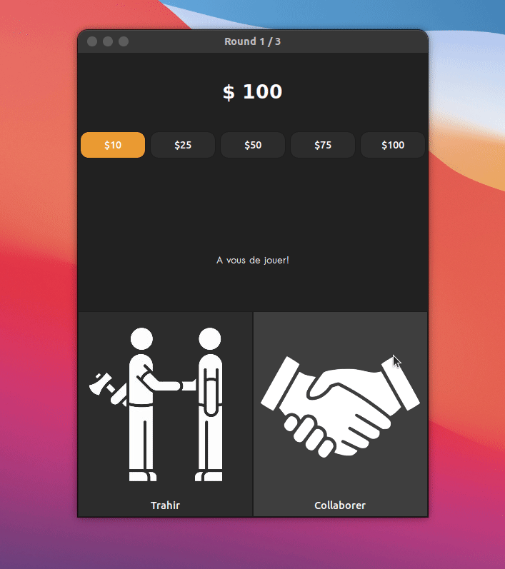

# ICS - Dilemme du prisonnier

## Contexte 
L’ICS (institue of Cognitives Sciences) est un laboratoire interdisciplinaire qui intègre l'expertise de chercheurs des Sciences de la Vie (psychologie cognitive, neurosciences) et de médecine (pédopsychiatrie, neuro-pediatrie) avec celle de chercheurs des Sciences Humaines et Sociales (linguistique computationelle et théorique et philosophie) pour étudier la nature et la spécificité de l'esprit humain. 

Le doctorant, qui n’est pas un développeur, a besoin d’accumuler des données expérimentales. Il a besoin que des volontaires jouent l’un contre l’autre un nombre de fois à définir, sans jamais savoir qui sont leurs adversaires.
On définira une partie comme étant un certain nombre de rounds. Un round est défini comme une confrontation trahison-collaboration entre les deux volontaires.

<h1 align="center">
    
</h1>


---
# Documentation
- [ICS - Dilemme du prisonnier](#ics---dilemme-du-prisonnier)
  - [Contexte](#contexte)
- [Documentation](#documentation)
  - [Installation](#installation)
    - [Dépendances](#dépendances)
      - [Distribution basée sur Ubuntu (Ubuntu, Linux Mint, Elementary, etc)](#distribution-basée-sur-ubuntu-ubuntu-linux-mint-elementary-etc)
      - [Fedora, CentOS](#fedora-centos)
    - [How to use](#how-to-use)
  - [Configuration](#configuration)
    - [Configuration serveur](#configuration-serveur)
    - [Configuration client](#configuration-client)
    - [Export des résultats](#export-des-résultats)
- [Développement](#développement)

## Installation 

### Dépendances

Ce projet est dépendant de la librairie [**libconfig**](https://hyperrealm.github.io/libconfig/).
#### Distribution basée sur Ubuntu (Ubuntu, Linux Mint, Elementary, etc)

Exécutez la commande suivante dans un terminal.

`sudo apt install libconfig-dev`
#### Fedora, CentOS

Exécutez la commande suivante dans un terminal.

`dnf install libconfig-devel`

### How to use

Exécutez la commande suivante dans un terminal.

```bash
# Clonez le dépot Github 
$ git clone https://github.com/victordrnd/socket-server.git

# Aller vers le répertoire
$ cd socket-server

# Compiler le projet (make all, make server, make client)
$ make all

# Executer le serveur/client
$ ./output/server
$ ./output/client

```


## Configuration

### Configuration serveur
La configuration du serveur se trouve dans le fichier `output/config/server_config.cfg` une fois le serveur compilé.

```json
bind_ip = "0.0.0.0";
bind_port = 7799;
max_simultaneous_connection = 50;

game_configuration =
(
  {
    name = "room_1";
    initial_amount = 50;
    nb_games = 10;
    clients = (
      {client_id = 1;},
      {client_id = 2;}
    );
  },
  {
    name = "room_2";
    initial_amount = 50;
    nb_games = 10;
    clients = (
      {client_id = 3;},
      {client_id = 4;}
    );
  }
);
```

### Configuration client
La configuration du client se trouve dans le fichier `output/config/client_config.cfg` une fois le client compilé.

```json
client_id = 1;
server_ip = "127.0.0.1";
server_port = 7799;
```

Il est par ailleurs possible de modifier la configuration en ajoutant des arguments à l'exécution du programme, ces changements sont **prioritaires** par rapport au fichier de configuration. 

```
Usage: client [OPTION...] 
client -- Dilemme du prisonnier de l'Institut des Sciences Cognitives  

  -c, --client_id=1          Force client_id over config file
  -h, --host=127.0.0.1       Force server_ip over config file
  -p, --port=7799            Force server_port over config file
  -?, --help                 Give this help list
      --usage                Give a short usage message

Mandatory or optional arguments to long options are also mandatory or optional
for any corresponding short options.
```


### Export des résultats
Une fois la partie terminée, les résultats sont accessibles dans le fichier `{nom_room}.csv`. 

> **Remarque** : A chaque démarrage de partie sur cette room, les anciennes données associées à cette salle sont suprimmées. **Il est important de sauvegarder les résultats après chaque partie.**

# Développement

La documentation spécifique au développement de ce projet est disponible [**ici**](docs/Readme.md)


